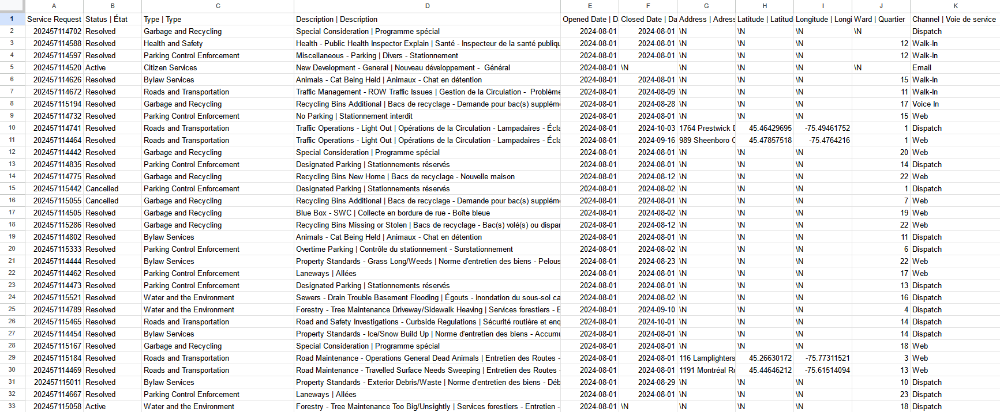
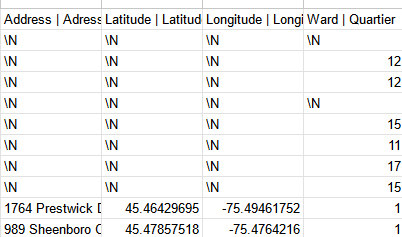

**November 4th 2024**<br>
**MPAD2003 Introductory Data Storytelling**<br>
**Aiden McCue**<br>
**Presented to Jean-Sébastien Marier**<br>

# Midterm Project: Exploratory Data Analysis (EDA)

Use one hashtag symbol (`#`) to create a level 1 heading like this one.

## Foreword

For this assignment, you must extract data from a dataset provided by the instructor. You must then clean and analyze the data, create exploratory charts/visualizations, and find a potential story idea. Your assignment must clearly detail your process. You are expected to write about 1500-2000 words, and to include several screen captures showing the different steps you went through. Your assignment must be written with the Markdown format and submitted on GitHub Classroom.

I have been assigning different versions of this project to my digital journalism and data storytelling students for a few years now. Its structure was inspired by the main sections/chapters of [*The Data Journalism Handbook*](https://datajournalism.com/read/handbook/one/). This version was further inspired by the [Key Capabilities in Data Science](https://extendedlearning.ubc.ca/programs/key-capabilities-data-science) program offered by the University of British Columbia (UBC).

**Here are some useful resources for this assignment:**

* [GitHub's *Basic writing and formatting syntax* page](https://docs.github.com/en/get-started/writing-on-github/getting-started-with-writing-and-formatting-on-github/basic-writing-and-formatting-syntax)
* [The template repository for this assignment in case you delete something by mistake](https://github.com/jsmarier/jou4100_jou4500_mpad2003_project2_template)

Did you notice how to create a hyperlink? In Markdown, we put the clickable text between square brackets and the actual URL between parentheses.

And to create an unordered list, we simply put a star (`*`) before each item.

## 1. Introduction

This report will be a overview and analysis of a City of Ottawa dataset. Specificly the data set of 311 service requests. 
The dataset I will be using will be a [CSV file](https://raw.githubusercontent.com/jsmarier/course-datasets/refs/heads/main/ottawa-311-service-requests-august-2024.csv) for requests started in the month of August 2024.
However the original CSV including signifcantly more of the year can be found [here](https://open.ottawa.ca/documents/65fe42e2502d442b8a774fd3d954cac5/about).
The dataset was collected by the City of Ottawa and then released to the public. It features all 311 services requests made and information about them. This information includes locations, dates and descriptions of the each request.
This report will be outlined in sections. These sections include getting the data, a quick overview of each column, cleaning the data.... 
## 2. Getting Data
### 2.1 Importation
To begin I first imported the dataset into Google Sheets. To do this I downloaded the CSV file mentioned previously. 
I then opened a new spreadsheet in [Google Sheets](sheets.new) and selected File > Import and then selected the CSV file.

<br>
*Figure 1: Initial dataset upon importation.*

After importing, the dataset will look like this. However by the end of the project it will look much different.
To see this you can view my [final spreadsheet](https://docs.google.com/spreadsheets/d/1GokeETvZ1cxyxIsTR-2ET4Xro1sdnuprIIzWWIWIJhU/edit?usp=sharing).

### 2.2 Initial Observations

Upon intial importation the dataset has 11 columns and 28539 rows. Each column features various different
aspects of recorded data about Ottawa 311 service requests. The dataset is taken from August 2024. The data is somewhat clean but will definitly need some work. There are many missing elements as well as needless clutter such as the translated elements.

### 2.3 Column Overviews

Column A features nominal variables indicating the service request number of every request. This column is somewhat redundant but could be helpful when needing to look at specific cases.

Column B features nominal variables indicating the status of the request. The status can be listed as active, resolved or canceled.

Column C features nominal variables describing the catagory of the request. Examples of this are bylaw services, road and transportation, licenses and permits and garbage and recycling. 

Column D featues nominal variables going into more detail about the 311 request. Examples of this is elaborating that the bylaw service was needed for a noise complaint or a overgrown lawn. 

Column E features ordinal variables indicating the opening date of each request. This column in particular is very helpful as it the only column that gives each data point a proper order. 

Column F features continuous variables indicating the closing date of each request. This column will be helpful when wanting to calculate the average resolve time. This column features many blank elements as some cases are still active. 

Columns G, H, I and J feature nominal variables indicating the location of certain requests. These columns indicate the address, latitude, longitude and ward of the request however the location of the request is only listed depending on the nature of it. An example when the location would be listed is when the city is repairing the road. This is because it does not leak any sensitive information that could be traced back to the requester.

Column K features nominal variables indicating the method of contact. These include dispatch (phone call), walk-in, web and email.

### 2.4 Inquiry about the dataset

When looking at the dataset one question that comes to mind is the average resolve time of each request. I think this could be helpful in building a story with the dataset and will be something that I want to pursue later on.

## 3. Understanding Data

### 3.1. VIMO Analysis

When looking over the dataset it appears to have strictly valid inputs. This can be expected when receiving data from a trusted source such as the City of Ottawa. There are no invalid points in the dataset. 
However there are many missing elements marked as /N. This can be seen in columns F, G, H, I and J. These elements as mentioned previously are missing because of privacy and service requests not being completed yet.
The dataset also features no outliers.

<br>
*Figure 1: Initial dataset upon importation.*
Support your claims by citing relevant sources. Please follow [APA guidelines for in-text citations](https://apastyle.apa.org/style-grammar-guidelines/citations).

**For example:**

As Cairo (2016) argues, a data visualization should be truthful...

### 3.2. Cleaning Data

**Here are examples of functions and lines of code put in grey boxes:**

1. If you name a function, put it between "angled" quotation marks like this: `IMPORTHTML`.
1. If you want to include the entire line of code, do the same thing, albeit with your entire code: `=IMPORTHTML("https://en.wikipedia.org/wiki/China"; "table", 5)`.
1. Alternatively, you can put your code in an independent box using the template below:

``` r
=IMPORTHTML("https://en.wikipedia.org/wiki/China"; "table", 5)
```
This also shows how to create an ordered list. Simply put `1.` before each item.

Insert text here.

### 3.3. Exploratory Data Analysis (EDA)

Insert text here.

**This section should include a screen capture of your pivot table, like so:**

<br>
*Figure 2: This pivot table shows...*

**This section should also include a screen capture of your exploratory chart, like so:**

<br>
*Figure 3: This exploratory chart shows...*

## 4. Potential Story

Insert text here.

## 5. Conclusion

Insert text here.

## 6. References

Include a list of your references here. Please follow [APA guidelines for references](https://apastyle.apa.org/style-grammar-guidelines/references). Hanging paragraphs aren't required though.

**Here's an example:**

Bounegru, L., & Gray, J. (Eds.). (2021). *The Data Journalism Handbook 2: Towards A Critical Data Practice*. Amsterdam University Press. [https://ocul-crl.primo.exlibrisgroup.com/permalink/01OCUL_CRL/hgdufh/alma991022890087305153](https://ocul-crl.primo.exlibrisgroup.com/permalink/01OCUL_CRL/hgdufh/alma991022890087305153)
