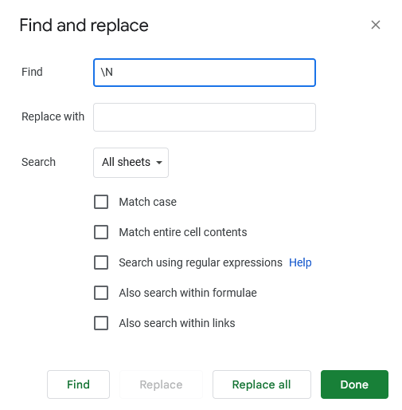
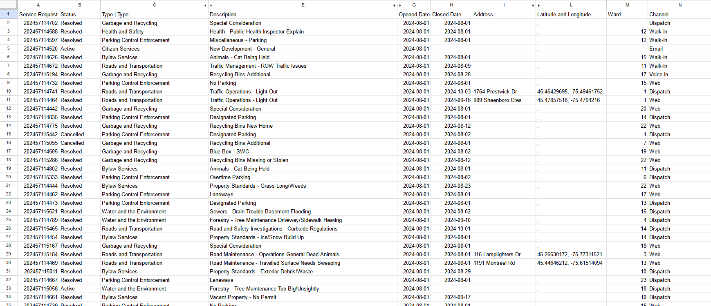
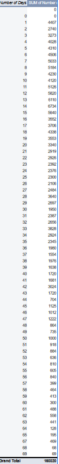
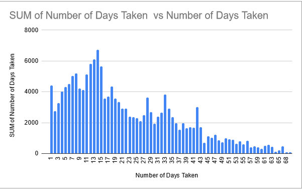

**November 4th 2024**<br>
**MPAD2003 Introductory Data Storytelling**<br>
**Aiden McCue**<br>
**Presented to Jean-Sébastien Marier**<br>

# Midterm Project: Exploratory Data Analysis (EDA)

Use one hashtag symbol (`#`) to create a level 1 heading like this one.

## Foreword

For this assignment, you must extract data from a dataset provided by the instructor. You must then clean and analyze the data, create exploratory charts/visualizations, and find a potential story idea. Your assignment must clearly detail your process. You are expected to write about 1500-2000 words, and to include several screen captures showing the different steps you went through. Your assignment must be written with the Markdown format and submitted on GitHub Classroom.

I have been assigning different versions of this project to my digital journalism and data storytelling students for a few years now. Its structure was inspired by the main sections/chapters of [*The Data Journalism Handbook*](https://datajournalism.com/read/handbook/one/). This version was further inspired by the [Key Capabilities in Data Science](https://extendedlearning.ubc.ca/programs/key-capabilities-data-science) program offered by the University of British Columbia (UBC).

**Here are some useful resources for this assignment:**

* [GitHub's *Basic writing and formatting syntax* page](https://docs.github.com/en/get-started/writing-on-github/getting-started-with-writing-and-formatting-on-github/basic-writing-and-formatting-syntax)
* [The template repository for this assignment in case you delete something by mistake](https://github.com/jsmarier/jou4100_jou4500_mpad2003_project2_template)

Did you notice how to create a hyperlink? In Markdown, we put the clickable text between square brackets and the actual URL between parentheses.

And to create an unordered list, we simply put a star (`*`) before each item.

## 1. Introduction

This report will be a overview and analysis of a City of Ottawa dataset. Specificly the data set of 311 service requests. 
The dataset I will be using will be a [CSV file](https://raw.githubusercontent.com/jsmarier/course-datasets/refs/heads/main/ottawa-311-service-requests-august-2024.csv) for requests started in the month of August 2024.
However the original CSV including signifcantly more of the year can be found [here](https://open.ottawa.ca/documents/65fe42e2502d442b8a774fd3d954cac5/about).
The dataset was collected by the City of Ottawa and then released to the public. It features all 311 services requests made and information about them. This information includes locations, dates and descriptions of the each request.
This report will be outlined in sections. These sections include getting the data, a quick overview of each column, cleaning the data.... 
## 2. Getting Data
### 2.1 Importation
To begin I first imported the dataset into Google Sheets. To do this I downloaded the CSV file mentioned previously. 
I then opened a new spreadsheet in [Google Sheets](sheets.new) and selected File > Import and then selected the CSV file.

<br>
*Figure 1: Initial dataset upon importation.*

After importing, the dataset will look like this. However by the end of the project it will look much different.
To see this you can view my [final spreadsheet](https://docs.google.com/spreadsheets/d/1GokeETvZ1cxyxIsTR-2ET4Xro1sdnuprIIzWWIWIJhU/edit?usp=sharing).

### 2.2 Initial Observations

Upon intial importation the dataset has 11 columns and 28539 rows. Each column features various different
aspects of recorded data about Ottawa 311 service requests. The dataset is taken from August 2024. The data is somewhat clean but will definitly need some work. There are many missing elements as well as needless clutter such as the translated elements.

### 2.3 Column Overviews

Column A features nominal variables indicating the service request number of every request. This column is somewhat redundant but could be helpful when needing to look at specific cases.

Column B features nominal variables indicating the status of the request. The status can be listed as active, resolved or canceled.

Column C features nominal variables describing the catagory of the request. Examples of this are bylaw services, road and transportation, licenses and permits and garbage and recycling. 

Column D featues nominal variables going into more detail about the 311 request. Examples of this is elaborating that the bylaw service was needed for a noise complaint or a overgrown lawn. 

Column E features ordinal variables indicating the opening date of each request. This column in particular is very helpful as it the only column that gives each data point a proper order. 

Column F features continuous variables indicating the closing date of each request. This column will be helpful when wanting to calculate the average resolve time. This column features many blank elements as some cases are still active. 

Columns G, H, I and J feature nominal variables indicating the location of certain requests. These columns indicate the address, latitude, longitude and ward of the request however the location of the request is only listed depending on the nature of it. An example when the location would be listed is when the city is repairing the road. This is because it does not leak any sensitive information that could be traced back to the requester.

Column K features nominal variables indicating the method of contact. These include dispatch (phone call), walk-in, web and email.

### 2.4 Inquiry about the dataset

When looking at the dataset one question that comes to mind is the average resolve time of each request. I think this could be helpful in building a story with the dataset and will be something that I want to pursue later on.

## 3. Understanding Data

### 3.1. VIMO Analysis

When looking over the dataset it appears to have strictly valid inputs. This can be expected when receiving data from a trusted source such as the City of Ottawa. There are no invalid points in the dataset. 
However there are many missing elements marked as \N. This can be seen in columns F, G, H, I and J. These elements as mentioned previously are missing because of privacy and service requests not being completed yet.
The dataset features some outliers in column D. These pop up when the service request is about water and environment. In these scenarios the description of the request is left as \N.

<br>
*Figure 2: Missing elements in dataset*

Support your claims by citing relevant sources. Please follow [APA guidelines for in-text citations](https://apastyle.apa.org/style-grammar-guidelines/citations).

**For example:**

As Cairo (2016) argues, a data visualization should be truthful...

### 3.2. Cleaning Data

When going to clean my data the first thing I did was remove the french translations on every column title. I did this by manually deleting them. I then used the split function to remove the translated desciptions of service requests. I did this by using the function below

``` r
=SPLIT(D2, "|")
```

I then dragged this function across every single row using the light blue circle in the bottom of the cell. After doing this I hid the orignal column as well as the french translations to make the dataset cleaner.

After that I concatenated the latitude and longitude columns. To do this I used the function below.

``` r
=CONCATENATE(J2, ", ", K2)
```
After inputting the function, google sheets prompted me with the option to autofill the entire column. I then accepted the autofill. After this I dragged the entire column down by one as the auto fill only seemed to prompt when putting the function in the first row. After this I hid the original two columns.

Finally I used the find and replace function to remove all the instances of "/N"

<br>
*Figure 3: Find and replace function to remove all instances of "\N"*

After all doing this my cleaned dataset can be seen below.

<br>
*Figure 3: My cleaned spreadsheet*

### 3.3. Exploratory Data Analysis (EDA)

To explore my data further I decided to find the average response time for 311 service requests. To do this I started by making a new column filled with the function below. I got this function from a YouTube video explaing easy methods to find the amount of days between dates. I then used it to calculate the amount of days between service requests opening and closing.
I then created a chart filled with the sums of the amount of days taken to process a request which can also be seen below. For the chart I chose a bar chart as noted in The Truthful Art: Data, Charts, and Maps for Communication (Cairo, 2016) because bar charts
are at the top of the scale of elementary perceptual tasks inspired by William Cleveland and Robert McGill. Bar charts provide easy and accuarate estimates for looking at data according to the scale which is exactly what I was looking for.
``` r
=(H2 - G2)
```

<br>
*Figure 4: My pivot table showing the number of days taken to fulfill service requests*

<br>
*Figure 5: My bar chart displaying the sum of each amount of days taken to fulfill service requests*

I chose to use the opening and closing variables as I found them to be the most interesting variables to look into. I think it's interesting how the service requests seem to spike at a two week window and then the frequency of longer dates gets shorter.
Overall through exlporing the data it points out that most requests are resolved within the first two weeks of opening. I think the next step to look into this would be to check for city policies to see if there is anything mentioned about a 14 day window.

## 4. Potential Story

Insert text here.

## 5. Conclusion

Insert text here.

## 6. References


Cairo, A. The Truthful Art: Data, Charts, and Maps for Communication. (2016). New Riders. https://ocul-crl.primo.exlibrisgroup.com/discovery/fulldisplay?context=L&vid=01OCUL_CRL:CRL_DEFAULT&search_scope=MyInst_and_CI&tab=Everything&docid=alma991022766731805153

Academy, C. (2024, May 2). Count days between two dates in Google Sheets. YouTube. https://www.youtube.com/watch?v=xqoMftuR34o 